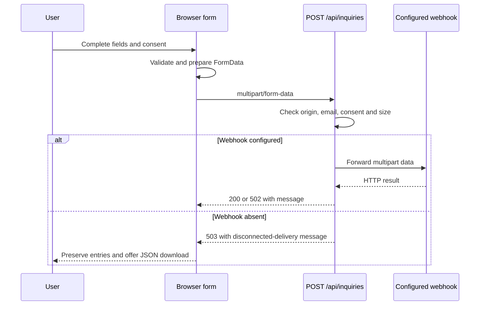

# Forms and inquiry API

[Documentation index](README.md) · Related: [Internal pages](internal-pages.md), [Deployment](deployment.md)

## Form entry points

| Route | Purpose | Submission `kind` |
| --- | --- | --- |
| `/en/frachtanfrage` | Select a transport mode. | No inquiry is submitted on this page. |
| `/en/frachtanfrage/strasse` | Road freight inquiry. | `strasse`. |
| `/en/frachtanfrage/schiene` | Rail inquiry. | `schiene`. |
| `/en/frachtanfrage/luft-und-see` | Air and sea inquiry. | `luft-und-see`. |
| `/en/frachtanfrage/autotransport` | Car transport inquiry. | `autotransport`. |
| `/en/frachtanfrage/logistik` | Logistics inquiry. | `logistik`. |
| `/en/kontakt` | General contact form. | `contact`. |

Other imported submission forms handled by the generic interaction code use `newsletter`. An actual mailing-list subscription still requires an appropriate owner-configured integration.

## How submission works



Freight forms use local HTML templates enhanced by `interactions.ts`. `ContactForm.tsx` is a React component mounted into `[data-contact-form]` by `ReferencePage`. Both call `sendInquiry()` in `components/internal/inquiry.ts`.

The forms do not save drafts in a database or restore them after a full page reload. Entries are retained in the current page's form elements when moving between steps or when delivery fails.

## Connect a delivery endpoint

Set these server environment variables in `.env.local` for local development, or in your application's production runtime:

| Variable | Required? | Meaning |
| --- | --- | --- |
| `INQUIRY_WEBHOOK_URL` | Required for delivery. | Your own endpoint that accepts multipart inquiry requests. |
| `INQUIRY_WEBHOOK_TOKEN` | Optional. | Sent to the webhook as `Authorization: Bearer <token>`. |

Without `INQUIRY_WEBHOOK_URL`, the application deliberately returns `503`. The form displays that the inquiry was not sent and offers a download. This is the default development behavior, not an email delivery service.

With a URL configured, the handler forwards the submitted `FormData` and waits up to 15 seconds for the webhook. Any successful webhook HTTP status is treated as acceptance. An unsuccessful status, timeout or fetch failure becomes a `502` response. The webhook's response body is not relayed to the browser.

The webhook is responsible for storing the inquiry, routing it to a team or delivering email. A successful application response means the webhook accepted the request; it is not confirmation that an email reached an inbox. There is no built-in retry queue or inquiry database.

## Request contract

The local route accepts `POST /api/inquiries` with `multipart/form-data`. The helper adds `kind` and forwards the form's existing field names. It does not convert every transport form to a common customer/shipment schema.

Contact-form fields are:

| Field | Type | Browser requirement |
| --- | --- | --- |
| `kind` | String. | Added by the helper as `contact`. |
| `email` | String. | Required email input. |
| `name` | String. | Required. |
| `subject` | String. | Required; input maximum 256 characters. |
| `message` | String. | Required; textarea maximum 10,000 characters. |
| `shipmentNumber` | String. | Optional. |
| `attachment` | File entries. | Optional; the same key may occur more than once. |
| `consent` | String. | Required checked checkbox; submitted value `on`. |

Freight fields retain names from their templates, such as `strasse_auftraggeber_email`. New cargo clones receive unique name suffixes of the form `__<identifier>` to distinguish repeated positions. Integrations should preserve repeated entries and files when parsing the multipart body.

A contact-shaped request can be checked locally without using the UI:

```bash
curl -i http://localhost:3000/api/inquiries \
  -F 'kind=contact' \
  -F 'email=developer@example.com' \
  -F 'name=Template developer' \
  -F 'subject=Local integration check' \
  -F 'message=Testing the contact delivery contract.' \
  -F 'consent=on'
```

Leave the webhook unset for a disconnected-delivery check. If it is configured, this request will be forwarded to that endpoint.

## Server validation and responses

The server checks an origin header when present, verifies an email-like field and an accepted consent-like field, rejects more than 500 multipart entries and applies a 10 MiB total payload-data limit. A content-length check also allows a small multipart-overhead margin. These server checks are separate from the browser's required-field and per-step validation.

The server does not currently validate a complete transport-specific schema, inspect attachment contents or enforce the contact UI's file-extension suggestions. `kind` is forwarded as submitted. If your receiving service needs domain-specific validation, implement it there or extend the handler deliberately.

Every handled response contains a JSON `message`:

| Status | Meaning | Browser behavior |
| --- | --- | --- |
| `200` | The configured webhook returned success. | Displays the successful-delivery message. |
| `400` | Multipart parsing failed, email/consent is invalid, or the entry count exceeds the limit. | Displays the message and keeps form entries. |
| `403` | The supplied origin host does not match the request host. | Displays the rejection message. |
| `413` | Payload size exceeds the configured limit. | Displays the size message. |
| `503` | No delivery URL is configured. | Displays the disconnected state and adds an inquiry-download button. |
| `502` | The delivery endpoint failed, timed out or returned an unsuccessful status. | Displays the failure message and keeps form entries for another attempt. |

## Downloads and attachments

The disconnected-state download is a JSON object with `kind` and a `fields` array of name/value pairs. File entries become file names in this download; file contents are not embedded in the JSON.

The contact UI suggests PDF, JPEG, PNG, DOC and DOCX attachments. When sending to a configured webhook, the actual files are included in the multipart body. The total data limit includes text fields as well as attachments. A deployment provider or reverse proxy may impose a smaller request limit; configure the deployment and receiving service accordingly.

## Multi-step behavior

Each freight form has client details, recipient information, order details, delivery scope and a send/summary step. `interactions.ts` tracks the current step and furthest completed step, validates progression, preserves previous inputs, updates summaries and manages repeatable cargo rows.

Checkboxes/selects reveal optional pickup/company/dangerous-goods fields using the existing template classes and field names. Country options come from `src/config/countries.json`. This file is maintained separately from the reference importer.

## Change or add fields

For a freight field, edit its transport HTML template. Preserve the surrounding step structure and use a stable `name` that your receiving endpoint understands. Apply appropriate native types and constraints, such as `email`, `number`, `date`, `required`, `min` or `max`.

| Template convention | What the interaction code uses it for |
| --- | --- |
| `form[action="/api/inquiries"]` | Identifies imported forms handled by the local submission flow. |
| `data-form="step"` | Defines a form step. |
| `data-form="next-btn"`, `back-btn` | Advances or returns between steps. |
| `data-form="custom-progress-indicator"` | Step navigation/current-state link. |
| `data-form="submit-btn"` | Final submission input. |
| `.form_cell`, `.form-label`, `.error-message` | Field layout, runtime label association and inline invalid-state display. |
| `data-dropdown="country"` | Populates a country select if it has only a placeholder option. |
| `data-input-field="field_name"` | Displays that named input's value in a summary. |
| `data-clone-wrapper`, `data-clone`, `data-add-new` | Define a repeatable cargo group and its add action. Their identifiers must agree. |
| `data-form="remove-clone"` | Removes a repeatable cargo row. |

Adding a summary line requires a matching `data-input-field` value. Renaming an input also requires updating summary selectors, conditional-field rules and your integration's field mapping. Some conditional behavior is tied to the existing names/classes, so use `interactions.ts` as the source of truth for those cases.

For the general contact form, edit `ContactForm.tsx`. Changes to the delivery protocol or result handling belong to `inquiry.ts` and the server route rather than to the HTML templates.

## Verify form changes

Run the browser suite with delivery unset. It checks all five freight modes, required progression, summaries, back navigation, a repeatable cargo row, contact submission and the disconnected-delivery result. Test a configured endpoint separately in your own integration environment. The existing suite is not a live-webhook or email-delivery test.
