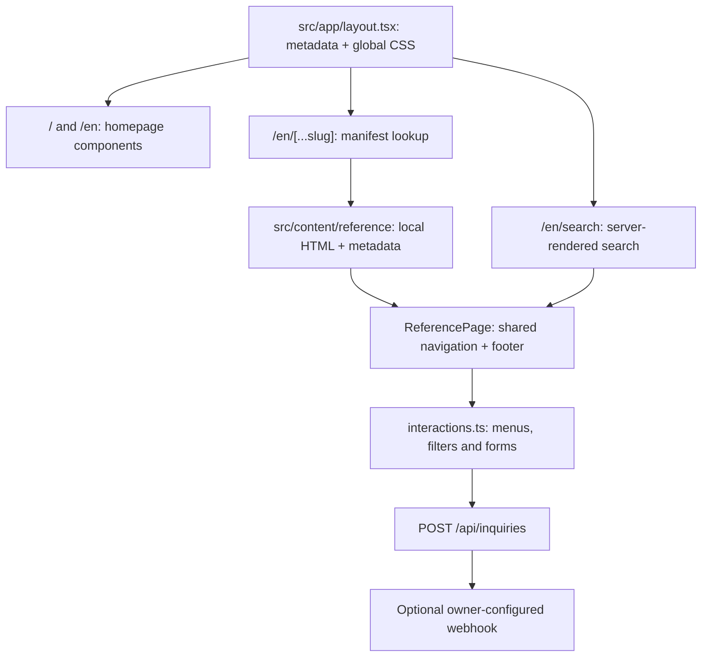

# Project structure

[Documentation index](README.md) · Previous: [Getting started](getting-started.md) · Next: [Customization and reuse](customization.md)

## Two rendering paths

The homepage is composed of React components. Internal reference pages are rendered from local HTML templates, wrapped in a React component that supplies shared navigation, footer, styles and interactions. These are separate authoring workflows inside the same App Router application.



The active homepage hero displays rendered video. It does not mount the procedural Three.js scene retained in `src/three/`.

## Repository map

```text
cargoflow-logistics/
├── docs/                         Developer guides and measured motion reference
├── public/
│   ├── favicon.svg               Site favicon
│   └── reference/
│       ├── asset-sources.json     Homepage asset provenance
│       ├── internal/             Imported internal-page images and fonts
│       ├── styles/               Scoped styles plus maintained interactions.css
│       └── ...                   Homepage video, images, fonts and Lottie JSON
├── scripts/
│   ├── import-reference.py       Public-reference content importer
│   ├── reference-requirements.txt Python requirements for that importer
│   ├── scope-reference.mjs       Internal CSS and search-index generator
│   └── verify-internal-pages.mjs Browser verification script
├── src/
│   ├── app/                      Routes, root layout and inquiry API
│   ├── components/
│   │   ├── internal/             Internal-page renderer and interactions
│   │   ├── journey/              Active video hero plus retained prototype UI
│   │   ├── layout/               Homepage header and smooth scrolling
│   │   ├── sections/             Homepage content sections
│   │   └── ui/                   Small visual components
│   ├── config/                   Navigation, countries, search index and brand data
│   ├── content/reference/        Internal HTML, source CSS, manifest and chrome
│   ├── hooks/                    Retained mobile-detection hook
│   ├── lib/                      Reference loading and animation helpers
│   ├── styles/globals.css        Homepage styles, base rules and fonts
│   └── three/                    Inactive procedural Three.js prototype
├── .env.example                  Documented webhook environment variables
├── AGENTS.md                     Next.js instructions for coding assistants
├── CLAUDE.md                     Tooling pointer to AGENTS.md
├── next.config.ts                Next.js configuration
├── next-env.d.ts                 Next.js-generated TypeScript declarations
├── package.json                  Dependencies and npm commands
├── package-lock.json             Resolved npm dependency versions
└── tsconfig.json                 TypeScript configuration and @/* alias
```

An empty `public/models/` directory may exist locally from the earlier prototype. No active page loads GLB or GLTF files from it, and no model-loader convention is implemented.

## Routes and server files

| File | Responsibility |
| --- | --- |
| `src/app/layout.tsx` | Root HTML/body layout, English language, global CSS, favicon and default SEO/social metadata. |
| `src/app/page.tsx` | Homepage composition and section order. Mounts the header, video hero, smooth scrolling and content sections. |
| `src/app/en/page.tsx` | Re-exports the same homepage at `/en`. |
| `src/app/en/[...slug]/page.tsx` | Awaits the Next.js route params, finds a manifest entry, generates static routes and page metadata, loads HTML and handles legacy freight redirects. |
| `src/app/en/search/page.tsx` | Reads the `query` search parameter and searches manifest headings, descriptions and stored search text. |
| `src/app/api/inquiries/route.ts` | Validates multipart inquiry requests and forwards them to the configured webhook, or returns a disconnected-delivery response. |
| `src/lib/reference.ts` | Exposes manifest data and reads the selected HTML file with Node's filesystem API. The renderer reads only manifest-selected file names. |

Default App Router behavior applies: pages and layouts are Server Components unless declared otherwise. Interactive modules such as the homepage header and `ReferencePage` are Client Components. Catch-all route params and search params are promises in this implementation.

## Homepage components

The following sequence matches `src/app/page.tsx`.

| Component | What it does | Main dependencies |
| --- | --- | --- |
| `layout/SmoothScrolling.tsx` | Initializes and cleans up Lenis for the homepage. Honors wheel events already intercepted by the hero. | `lenis`. |
| `layout/Header.tsx` | Homepage navigation, submenu links, mobile menu and a search preview of up to eight matching entries. | Navigation configuration and generated search index. |
| `journey/JourneySection.tsx` | Controls the five video scenes, frame ranges, transitions, tabs, hotspots and scroll interception. | GSAP, `ServiceGlyph`, `journey.mp4` and the poster. |
| `sections/MissionSection.tsx` | Introductory message, truck artwork and shipment/freight links. | Local reference images. |
| `sections/NetworkSection.tsx` | Statistics, sticky globe transforms and scroll-controlled Lottie routes. | `lottie-web`, `lib/motion.ts`, globe image and route JSON. |
| `sections/ServicesSection.tsx` | Service-card grid with internal links. | `config/navigation.ts` and service images. |
| `sections/ExpertiseSection.tsx` | Company copy, photo collage and company/services links. | Local collage images. |
| `sections/InsightsSection.tsx` | Featured news and two additional news cards. | Local article data, `newsLinks` and news images. |
| `sections/FinalCta.tsx` | Final call to action and the homepage footer. | Local CTA/certificate assets and several inline links/contact values. |
| `ui/ServiceGlyph.tsx` | Service-specific SVG glyphs used by the hero's scene tabs. | Its `type` prop. |

Most homepage copy is written directly in these components. There is no CMS or universal component-props configuration for all homepage content.

## Internal-page components

| File | Responsibility |
| --- | --- |
| `internal/ReferencePage.tsx` | Loads the three internal stylesheets; renders `.reference-page`, shared navigation/footer and HTML or React children; initializes interactions and portals the contact form into its placeholder. |
| `internal/interactions.ts` | DOM interactions scoped to the page wrapper: menus, search toggle, accordions, tabs, carousels, multi-step forms, conditional fields, cargo clones, summaries, filters and sorting. Returns listener cleanup. |
| `internal/ContactForm.tsx` | Accessible React contact form, including attachments and consent. Calls the shared submission helper. |
| `internal/inquiry.ts` | Sends `FormData` to the local API, manages status/button state and offers a JSON download on the disconnected-delivery response. |

These modules depend on the classes and attributes in the stored templates. The attribute contract is documented in [Internal pages](internal-pages.md) and [Forms and inquiry API](forms-and-api.md).

## Content, configuration and assets

| Location | What it contains | How to maintain it |
| --- | --- | --- |
| `src/config/navigation.ts` | Service-card records, transport/account/career URLs and homepage news destinations. | Edit for navigation and homepage links; also check links written directly in components and shared chrome. |
| `src/config/countries.json` | Country option names/values captured from the rendered reference. | Edit independently when changing country choices. The importer does not regenerate this file. |
| `src/config/search-index.json` | Lightweight `{ href, title, description }` entries for homepage search. | Regenerate with `npm run reference:styles`. |
| `src/config/brand.ts` | Exported `BRAND` constants. | Currently not imported by the rendered page components; editing it alone does not rebrand the site. |
| `src/content/reference/manifest.json` | Route keys, file names, metadata, search text, theme values and source URLs. | Edit with corresponding page content, or regenerate deliberately using the importer. |
| `src/content/reference/chrome.json` | Shared navigation and footer HTML strings. | Edit for internal navigation/footer changes; an import overwrites it. |
| `src/content/reference/*.html` | Each internal page's main content, including freight-form markup. | Edit local content. Keep the interaction attributes intact. |
| `src/content/reference/*.css` | Original shared CSS and page-specific embedded styles. | Edit source styling and regenerate the scoped public CSS. |
| `src/content/reference/assets.json` | Original internal asset URL to local asset URL inventory. | Generated by the importer; useful for finding an asset's source. |
| `public/reference/asset-sources.json` | Homepage asset names and their original source URLs. | Keep provenance current when replacing assets. |
| `public/reference/internal/` | Local internal assets, usually named by a URL hash. | Update the HTML/CSS references when replacing or renaming files. |
| `public/reference/styles/interactions.css` | Maintained interaction overrides, form and search styling. | Edit directly; the CSS generator does not regenerate this file. |
| Other `public/reference/styles/*.css` | Scoped output of the source CSS. | Regenerate; direct edits are overwritten by the style compiler. |
| `src/styles/globals.css` | Base/homepage CSS, local font faces, responsive rules and motion-related layout. | Edit with homepage animation/layout checks. |

Files under `public/` are requested at URLs without the `public` prefix. For example, `public/reference/truck.webp` is served as `/reference/truck.webp`.

## Retained prototype modules

These files are available for future reuse but are not mounted by the current homepage or internal routes.

| Location | Existing purpose |
| --- | --- |
| `src/three/canvas/ExperienceCanvas.tsx` | React Three Fiber canvas setup, rendering quality settings and composition of the prototype world, camera and lights. |
| `src/three/canvas/CanvasBoundary.tsx` | Error boundary for a WebGL scene. |
| `src/three/animation/JourneyScrollController.tsx` | Maps prototype section scroll progress into the mutable journey store. |
| `src/three/animation/journeyStore.ts` | Prototype progress, velocity, direction, stage and canvas-status values. |
| `src/three/camera/CameraRig.tsx` | Camera movement along prototype keyframes. |
| `src/three/lighting/JourneyLighting.tsx` | Prototype scene lighting driven by progress. |
| `src/three/environments/CampusEnvironment.tsx` | Procedural logistics-campus environment. |
| `src/three/world/JourneyWorld.tsx` | Composes and animates the campus, trucks, van, train, parcel and route mesh. |
| `src/three/models/Truck.tsx`, `Train.tsx`, `DeliveryVan.tsx`, `Parcel.tsx` | Procedural model components, rather than loaded GLB assets. |
| `src/three/models/brandTexture.ts` | Branding texture helpers for the procedural models. |
| `src/components/journey/JourneyNarrative.tsx` | Narrative overlays for the earlier prototype journey. |
| `src/components/journey/JourneyDebugHud.tsx` | Prototype store diagnostics, gated by `?debug=1` if the component is mounted. Adding that query alone does not enable a HUD on the current homepage. |
| `src/components/ui/BrandMark.tsx`, `VehicleIcon.tsx` | Retained decorative/icon components. |
| `src/hooks/useIsMobile.ts` | Mobile/coarse-pointer detection used by the prototype canvas. |
| `src/lib/math.ts` | Progress, interpolation and damping helpers used by the prototype. |

`src/lib/motion.ts` is active: the globe uses its Bézier easing functions. Do not treat every file under `src/lib/` as prototype-only.

## Generated and tooling files

`node_modules/`, `.next/` and `tsconfig.tsbuildinfo` are dependency/build/typecheck output. `next-env.d.ts` is managed by Next.js. Edit the source and configuration files rather than those outputs.

The repository also keeps generated reference content and scoped styles under version control because they are required to render the internal pages. They are different from disposable `.next/` build output.

`AGENTS.md` is a Next.js-maintained coding-assistant instruction file, and `CLAUDE.md` points to it. They are tooling metadata, not website content or developer tutorials. Keep them alongside the developer documentation.
